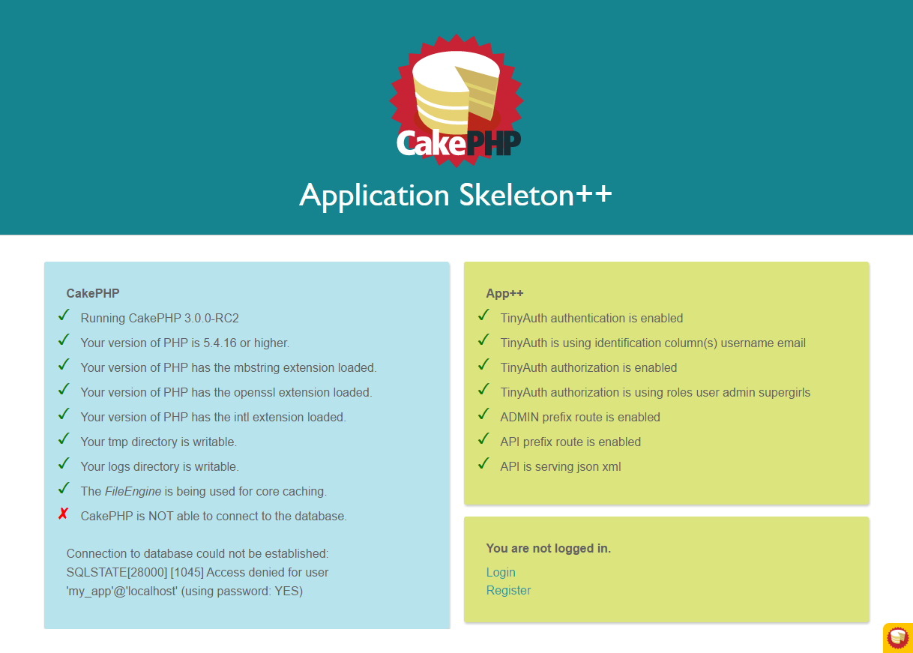

# CakePHP Application Skeleton ++

Basically the CakePHP 3.x app skeleton with some pre-configured plugins to
speed up application prototyping:

- [CRUD](https://github.com/FriendsOfCake/crud)
- [TinyAuth](https://github.com/dereuromark/cakephp-tinyauth): basic user registration and login
- [JWT](https://github.com/ADmad/cakephp-jwt-auth): JSON Web Token authentication
- [TinyAuthorize](https://github.com/dereuromark/cakephp-tinyauth): role based ACL
- [Codeception](https://github.com/cakephp/codeception): UI testing

Easy on/off [configuration](https://github.com/alt3/cakephp-app-plusplus/blob/master/config/app_custom.php) for:

- authentication
- authorization
- /api route
- /admin route

